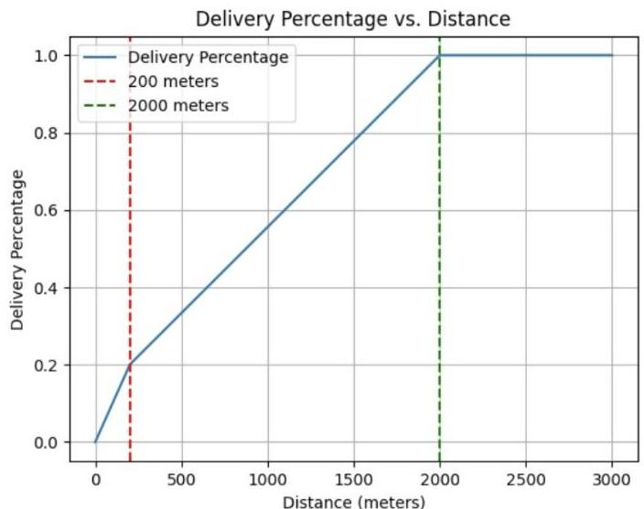
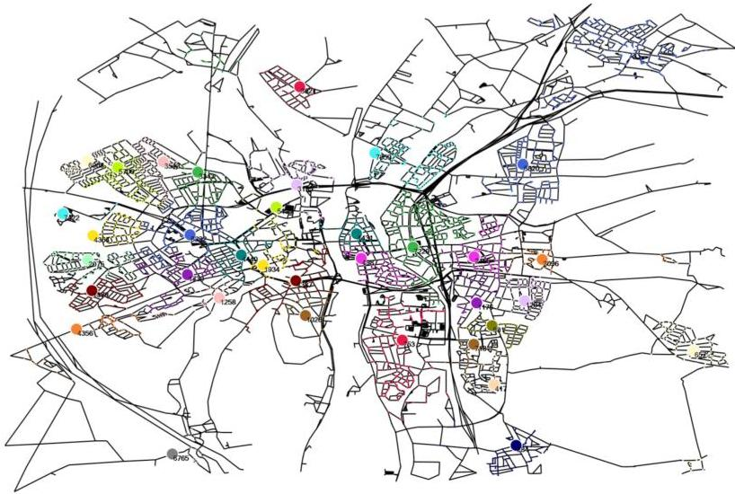
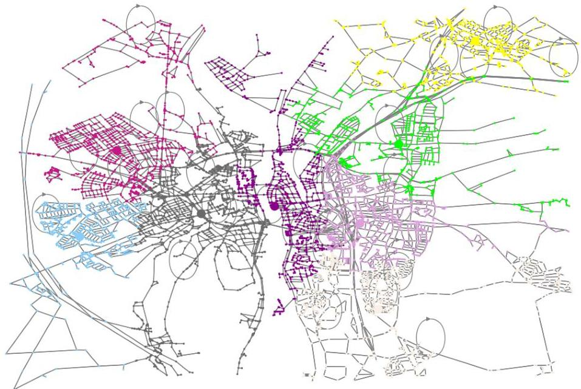
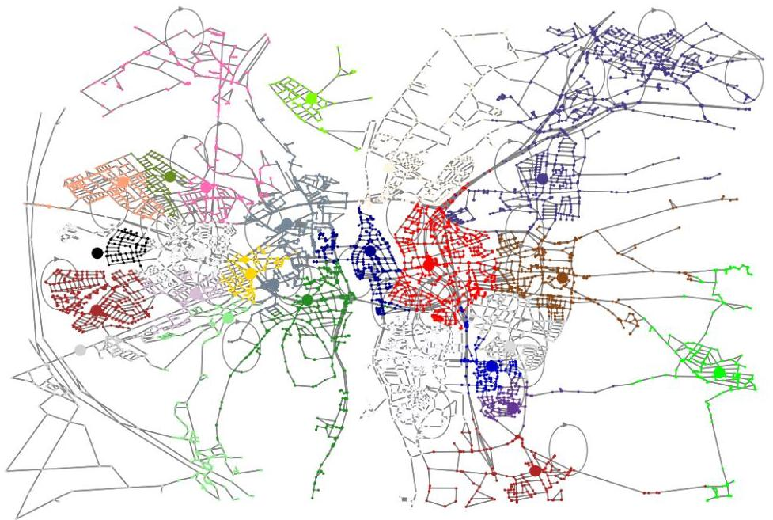
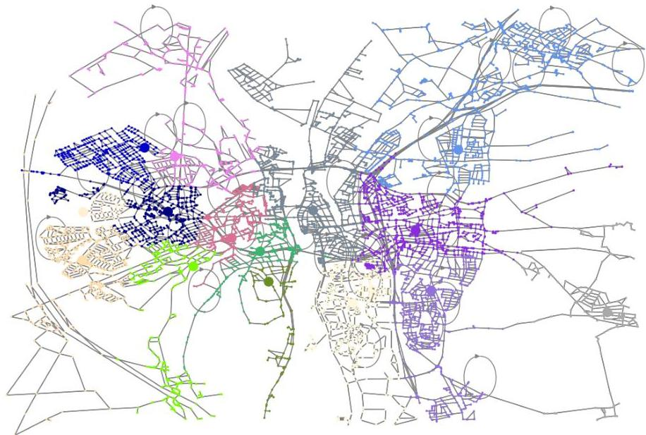
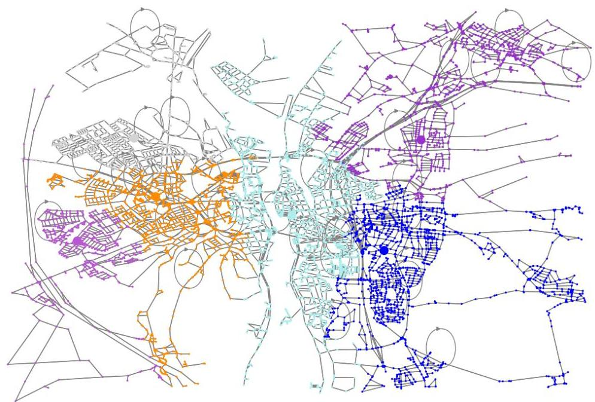

# Introduction

This report will first cover how we understood the problem. Afterwards, it details how customer behaviour was modelled; how the optimal solution was found, and how it compares to the existing network; how the recommended solution was found and how it compares to the existing network; as well as a final recommendation and discussion of the solutions.

# Problem Specification

This report has been prepared at the request of Post&amp;L, a leading Dutch postal company. The goal is to analyse and improve the last-mile delivery system in Maastricht. During the Covid-19 pandemic, the demand for Post&amp;L's services grew rapidly, resulting in a record 337 million parcels delivered in 2020. It was a year with highly variable demand, with peaks during holiday periods, reaching around 1,7 million packages being processed daily. The company was forced to adapt quickly, making significant changes to their system without much time to plan ahead. As the pandemic ended, the picture of customer demand has changed again, influenced by the growth of e-commerce and more people working from home. The existing network, which is the result of the rapid-response changes which were necessary at the time, is now inefficient and in need of improvement.

Currently, the existing delivery network of Post&amp;L revolves around service points, which include dedicated post offices as well as service desks in supermarkets and corner shops. Delivery drivers either deliver packages directly to the customers' front doors from the nearest service point, or, if they are not home, drop the packages off at the service point for later collection. Increasingly, customers are choosing to have their packages delivered directly to service points, bypassing home delivery altogether. This trend offers some benefits: customers do not need to be home to receive their packages and can collect them at their convenience, typically while grocery shopping. This reduces city congestion and pollution and generates significant cost savings for Post&amp;L, as last-mile delivery is the most expensive segment of a parcel's journey.

Additionally, there is one more metric the company would like to include, namely the bounce rate, which is a KPI for them. It is derived from the capacity of a point, if at any day they do not have enough capacity, the extra parcels to be picked up are moved to the next day. It causes slight delays, but great customer dissatisfaction. This report will target this KPI occurrences to be at most 1% city-wide average, and at most 2% in any given service point.

Lastly, as signified by Post&amp;L, though the company recognizes the need for structural change in Maastricht's networks, costs of revamping, such as the cost of opening a new service point, or even that of closing an existing location are significant, and as such, determining a layout that improves cost without significant changes was also important.

In conclusion, considering the current trends, Post&amp;L is in need of a change of its network. This report will provide the company with insights into how to redesign the network. Which shall lead to achieving an efficient, cost-effective, and customer-friendly delivery system in the post-pandemic landscape, by answering those three questions:

- What would the optimal network look like?
- How much money would be saved yearly by using the optimal network compared to the current situation?
- Is it possible to approach the optimal situation by making only a few small changes?

# The Data

The analysis described in the report was based on data provided by Post&amp;L, sourced both from their internal records and external sources, mainly Google Maps and CBS demographics database.

To begin with, a data set composed of a total of 8485 nodes and their coordinates were provided. Next to this, another data set was facilitated with the information about the edges, in this case, the roads that connect all of the nodes with the service points and between themselves. Some of the information provided include the geographical coordinates of the nodes that each road connects, lengths of these roads, speed limits, names, and type of road. All of the just described data has been extracted from Open Street Maps through the use of OARBench.

Moreover, demographical data representing 500x500 metre squares is provided, such as population density, age groups, income level, household type and home ownership, among others. Although some data is not made available for low population areas to preserve the privacy of the residents. For some squares, all information is unavailable, as these are empty regions and do not have people registered living in them.

Similarly to the nodes data set, the information for the 35 service points is also provided, such as their geographical coordinates, which includes the square they are part of, the population they serve and the total deliveries and pickups registered over the last year of 2023.

Furthermore, a more in depth data set showing the deliveries and pickups from each service point for each of the 365 days of the year can be found. Also, a graph has been made to visually represent the current road and service point network in Maastricht, where the service points and nodes, which they serve, are in the same colour.

Lastly, the company's data suggests that nodes 200m from a service point will have  $20\%$  of the orders being delivered, going up to 2000m where all of them choose deliveries. This information gives significant insights to the report and will prove itself useful in the delivery cost estimations for each of the solutions. It can be visualised by this graph:

# Modelling the Customer Base

## Allocating Customers to Service Points

### Modelling the Population

Given that the data provided offers only a very limited understanding of the distribution of population in Maastricht, as the demographic data sourced from CBS provided population figures for squares of 500 by 500 metres, and the only other source of population data was Post&amp;L's own estimation of the overall population served by the existing network; several key simplifying assumptions had to be made regarding how the customer base will be modelled, with the final decision being to allocate population to the various nodes (intersections) within the OAR data of Maastricht's layout.

Representing the overall population of the city as intersections, each with an assigned population, offers the advantage of easy allocation of customers to service points, while also staying in line with Post&amp;L's own representation of the network, where instead of providing actual addresses of the service point locations, only the node of the location was provided. Importantly, despite providing some information regarding the road types (mainly the type, e.g. "residential" or "service"), the dataset still lacked information on the actual infrastructure, such as the number of people or even the number of houses along a given road. The nodes are a fine approximation, as they represent points customers would have to travel through to pick up a parcel, or points a delivery truck has to drive through to deliver a parcel, and the short distance from the node to the actual front door of the customer is somewhat irrelevant in the grand scheme of things.

Understandably, though this representation is a gross oversimplification, and hence can affect the calculations somewhat, it was deemed the best approximation given the task and the data provided. One other alternative was covered - mainly allocating population to the roads. This offers several key advantages - the type of the road is known, meaning edges where customers are likely to live (such as "residential") can be distinguished from edge

types where that is likely not the case (e.g. "motorway"). It also offers some computational advantages when it comes to determining the actual number of people "living" at a given node, mainly the road length could be some indicator of its population. However, this representation also runs into the problem that we have no idea of the infrastructure in place - e.g. A residential road of a 500m length might only have single family houses alongside it, meaning it would have much less population than a nearby 200m road with 6 story apartment complexes. Furthermore, this representation also introduces some further complication in determining the distances between customer and service point. Given these factors, and the fact that this allocation performed worse in our test (which will be discussed shortly), we chose the node representation.

## Distributing customers among the nodes

Given the chosen representation, the next challenge was to allocate population to each node. The final chosen approach was to distribute the population of a square equally amongst its nodes (assuming a population of 2 for squares where this data was not disclosed, as this is the nearest whole value to the typical Dutch household size¹.

Clearly, this is another simplification, yet it is done for good reasons. Firstly, seeing as we have little to no idea on the distribution of population beyond the "square level", any other possible approach would also be a simplification, but one that would require much more calculation. As will be discussed later, we assumed that the whole population of a square shared the same demographic characteristics, hence this approach had the advantage of also following this square "uniformity" assumption. Importantly, for nodes not located in any of the squares, of which there were 572 of those, we simply allocated a flat population value of 0.3 each. As these were located mainly in areas on the edges of Maastricht and allocated to service points with very little traffic, they were not significant in shaping the solution, but some importance still should've been placed on those nodes. The figure used, which was a necessary "guess", given the complete lack of data for these nodes, was chosen through trial and error when testing node allocation (which will be described in subsequent sections).

Regardless, this simplified representation does introduce some source of error, as some specific areas within a square might have too little or too much effect on the chosen final solution, with the simplification over or underestimating the actual population. The main alternative considered was to allocate population to nodes based on the length of their edges. The approach would work as follows: if the edge between nodes A and B (both located in the same square) contributes to 10% of the total road length in that square, then both nodes would be allocated 5% of the square's total population each. This approach however, is also a simplification, and there is little to no guarantee that it is a better one. It was also much more computationally intensive. Given these factors, we opted to follow the assumption of in-square uniformity.

## Allocating nodes to service points

After we had an image of how the population was distributed, we had to decide on how we would allocate the customers (nodes) to the service points. We first did this with the current

¹ Data obtained from CBS - https://www.cbs.nl/en-gb/visualisations/dashboard-population/households/households-today

network, as Post&amp;L provided us with a visualisation, as well as the estimated population per service point, which we could use to verify the assumption. The chosen approach considered walking distances (disregarding if roads are one way) below a cutoff of 675 metres, and driving distances (factoring in whether roads are one way) for distances above that, with the final allocation being based on the shortest distance from a service point to the given node.

The allocation is performed as follows. Firstly, the distances between all possible pairs of nodes were calculated, one table, representing walking, with distances when disregarding whether roads are directed (one-way), and one table, representing driving, where directed distances are considered. The two were then combined, where all undirected distances below 675 metres were considered, and directed distances would be used above that cutoff. The figure was derived from the pick-up ratio distribution described to us by Post&amp;L (assuming a linear drop-off between 200 and 2000 metres), and it represents the point at which a customer is equally likely to pick-up the package or have it delivered (disregarding demographic factors). The nodes are there allocated based on distance from the given service point to the given node, as walking distances are reversible, and for driving distances, deliveries start at the service point.

This was done using the Dijkstra algorithm (running the algorithm from every single node). It is a well-known single-source network algorithm, which finds the shortest path from the source node to all other nodes in the graph. It essentially explores the unvisited nodes one by one, starting from the one which is the closest to the start, then moving on to the one that would be second closest and so on. Everytime it visits a new node, it updates the distances of all nodes immediately neighbouring (so one edge away), essentially accounting for the possibility that the shortest path to that node might be through the node being currently considered. It was chosen over the other possible algorithms (e.g. Floyd-Warshall) as it is efficient in sparse networks.

# Testing the Allocation

The various methods of distributing population among the nodes were tested against the estimates of population served by each service point as provided by Post&amp;L. The chosen representation achieved very close results, with the largest difference for a single service point being an overestimation of 400 (for location 7229, which serves roughly 10276 people),

and overall the deviations were quite low, meaning this approximation was deemed more than acceptable.

# Understanding Customer Behaviour

Understanding the customers behaviour is important for optimising the delivery network of Post&amp;L. By analysing the demographic data from the parcel delivery and pickups and their influence on demand, we could better predict how demand could change when a service point is moved.. Within this section, we present our main findings on how the various demographic factors affect demand. These results consist of an expected demand and expected pick-up ratio (disregarding distance) for each node, data which was later used when obtaining the optimal solution.

# Main Findings

## Increased Demand:

The analysis revealed that increased demand for parcel deliveries is mainly influenced by a larger population in a given area (exactly as expected). Additionally, neighbourhoods with a higher proportion of teens and students (age 15-25) seem to also have an increased demand.

## Decreased Demand:

The demand tends to decrease in areas with a higher proportion of females and children (age 0-14). In these areas Post&amp;L is not likely to register a high demand. Another factor contributing to decreased demand is the rate of home ownership; neighbourhoods where more people own their houses appear to show a decline in demand.

## Increased Pickup Ratio:

In areas with more multi-person households customers tend to pick up parcels themselves. This is especially true in places where there is a higher proportion of students (age 15-24), likely since this is where the financial and convenience advantages of package pickup become apparent.

## Decreased Pickup Ratio:

Factors that make pickups less common include higher home ownership rates and a higher female ratio in the area. Additionally, areas with more households with a higher income tend to show a lower rate of parcel pickups, likely due to the preference for the convenience of home delivery.

# Technical Details

To reach these conclusions, a linear regression analysis was conducted on the new allocations and proportions of the demographic segments. The analysis focused on understanding the correlation between these variables and the demand for parcel deliveries and pickup.

17

The prediction was done for each node (disregarding nodes not located in a square), with each node being assigned the demographic characteristics of its square. The independent variables (except for ratios or proportions) were all adjusted to match the target of the regression. For the pickup ratio the variables were adjusted to ratios while for total demand the variables were adjusted by population allocated. We used the data provided by square demographic and allocated service point as reference which was then modified where needed to match the size of the road in order to more accurately reflect reality.

In cases where we encountered missing data for certain variables, we replaced these missing values with estimates using data averages. This however shouldn't influence the model significantly since the proportion of missing variables was below 5% in most cases.

The model's variables were selected to ensure that the attributes were not correlated with each other at such magnitudes that it would affect the model while also being significant. The ratio where used to more match the pickup ratio. We decided to use a ratio as a target variable as it would allow us to more easily integrate with the provided pickup ratio by distance. Also, this will allow us to incorporate the total demand more easily in our future calculations.

## Target variables:

- Pickup ratio, calculated as the percentage of parcels being picked up out of all packages, with values between 0 and 1, the latter meaning 100% of the parcels are picked up and 0 meaning none of the parcels are picked up.
- Total demand represents all parcels Post NL handles, therefore the sum of delivery and pick-up parcels. This value is adjusted for each node based on the population. So if a street represents 0.1% of the population of, it will be allocated 0.1% of the total demand of the nearest service point.

## Independent variables:

- The female proportion represents the percentage of the population that is women. The value is between 0-100, where 0 represents no women are present in the area and 100 meaning all of the residents are females
- Age 15-24 proportion: Represents the percentage of the population aged 15-24. The value is between 0-100, where 0 means no residents are aged 15-24, and 100 means all the residents are aged 15-24.
- Multi-person households without kids proportion: Represents the percentage of multi-person households without kids. The value is between 0-100, where 0 means no multi-person households without kids, and 100 means all households are multi-person households without kids.
- Age 65+ proportion: Represents the percentage of the population aged 65 and older. The value is between 0-100, where 0 means no residents are aged 65+, and 100 means all the residents are aged 65 and older.
- Population to households ratio: This represents the ratio of the total population to the number of households. The value is the total number of people divided by the number of households. The average ratio is 2.4 in our data set.
- The adjusted variables in the model represent the absolute value of that certain variable in a specific node, the adjustment being made by considering the length of the street to provide a more accurate representation. If a street is allocated 1% of the

18

square population this would mean that all adjusted variables for that street represent  $1\%$  of the value of the square the node it's in.

# Pickup Ratio

The linear regression for pickup ratio had limited precision, as we excluded distance while the distance proved to be extremely determining. In our case the current regression has an R-squared value of 0.039. However, just by including distance in our linear regression we can increase this value to over  $89\%$ . The reason we didn't use distance in our final model is that we wanted to account only for the effect of demographics and as Post%L provided findings of customers' behaviour related to the distance to a service point, we considered that to be a more accurate representation.

|  Variable | Coefficients | P-value  |
| --- | --- | --- |
|  Const | 0.5404 | 0.000  |
|  Female Proportion | -0.0011 | 0.001  |
|  Homeownership % | -0.0003 | 0.000  |
|  Age 15-24 proportion | 0.0024 | 0.017  |
|  Multi-person households w/o kids proportion | 0.001 | 0.000  |
|  Income median | -0.0005 | 0.003  |
|  Age65+ proportion | 0.0006 | 0.004  |
|  Population to households ratio | -0.0038 | 0.000  |

# Total Demand

The total demand linear regression proved to be very accurate with a R-squared value of 0.98. This is mostly attributed to the diverse data set that allowed us to include most of the factors influencing demand. Another reason is also the extremely high correlation between population and demand. When comparing the predicted value and the actual values we have an absolute difference of  $9.36\%$ , however, this value decreases if we consider the combined demand across all streets and nodes resulting in an absolute difference below  $3\%$  between predicted and actual results.

|  Variable | Coefficient | P-value  |
| --- | --- | --- |
|  const | 4.5112 | 0.000  |
|  Adjusted Female | -1.8663 | 0.004  |

Using these insights Post&amp;L can better customise the locations of their service points and capacities to match the demographic characteristics of different neighbourhoods, optimising their last-mile delivery system.

# Optimising the Network

This section details how we actually arrived at the optimal network, as well as the recommended immediate and long-term solutions. It is important to highlight that all cost values discussed here are considered per year.

# The Data Used

The data used in actually obtaining the final solution is a combination of the results we obtained as described in the previous parts of the report. Firstly, for the purpose of allocations, we used the distance matrix as described in the previous parts. To determine the demand at each node, we used the results of the linear regression for total demand. For nodes where the regression could not be applied, we took the expected demand as 10.899 times the assigned population (the median ratio for the nodes where we could make the prediction). Similarly, we also considered the pick-up ratio from the regression for each node, filling in with the median ratio of 0.5726 for nodes which could not be used in the linear regression. Importantly, this pick-up ratio is only meant to represent how the demographic factors affect the willingness to pick-up for customers represented by that node. We might highlight that nodes that could not be used in the linear regression lacked any demographic data, hence this is the best approximation, and medians were used as they are more robust (less affected by) to extreme values.

# The Cost Calculation

The cost calculation for each considered solution was implemented mainly based on the estimated data provided to us by Post&amp;L.

Firstly, the fixed cost was simply given to us as 75000 per location.

Secondly, the delivery costs were calculated as follows. For each node, we would determine what percentage of the expected demand would be pick-ups. This was a combination of the picku-up ratio value from regression (weighted by 0.1) and the estimation from the pick-up ratio distance distribution provided by Post&amp;L. The cost of delivering one package to a given

node was then taken as the distance from the assigned service point to that node, with a 0.50 per kilometre cost.

Lastly, the capacity costs were taken to ensure that the solution meets the KPI assigned to us by Post&amp;L - mainly maximally 1% bounce rate city-wide, and the 2% bounce rate per each service point. As we noticed that capacity costs are by far the smallest source of cost during our analysis of the current network (this was also told to us by Post&amp;L), we decided to implement a flat 1% maximum bounce rate for each service point, as this did not significantly affect cost, but lead to better customer satisfaction. In order to determine the necessary capacity for each service point, we analysed the variability (standard deviation), in the daily pick-ups for the current network in the year 2023. For each service point, we determined the standard deviation as a percentage of the mean (over 312 working days). Since the distribution of parcels picked-up was not normal for each service point (verified using the Shapiro test), we took the maximum from those values, and scaled it by 1.5, to err on the safe side. We then, for each service point, calculated the daily mean number of parcels picked up (analogous to what's described in the delivery cost section), and the standard deviation from this percentage (which came out to about 85%). We then constructed a normal distribution for each point, and took the value corresponding to a 99% left tail as the daily capacity for each point. Each capacity unit costs 0.1 daily.

## The Algorithm

Simulated Annealing, the algorithm used to get this solution, is an Heuristics algorithm, meaning it finds a solution close to the optimum by exploring the possible solutions, which in this case are possible networks, with the objective of finding one good enough and close to the optimal. It starts by producing a random solution (or an empty solution) and from there it makes small and incremental changes (through the chosen operators) until it reaches convergence or simply ends. It is based on the natural process of crystallisation.

At first, the changes are quite random, and it might even be possible that some of these changes worsen the solution, but as time passes (or the model "cools down"), the model becomes less likely to accept a worse solution. A positive change is always accepted. This is so that we don't get stuck with a suboptimal solution. As seen, the process is somewhat random, but one can control that through parameters such as temperature (determines how often worse solutions are accepted) and the number of iterations.

## The Implementation:

The chosen operators (with equal chance) were:

- Add a service point - opens a new location at a randomly selected node, of course only if a location does not exist there
- Remove a service point - closes at random one of the existing service points, adding it back to the pool of possible locations. This applied only if there is more than one location open.

Other operators, such as relocating a random point, were also considered, but ultimately not implemented for simplicity's sake.

The chosen cooling schedule was Temperature = $\frac{\text{max iterations}}{\text{iteration}}$. This was chosen to provide relatively slow cooling, allowing for more of the solution space to be explored.

Regarding the acceptance probability, the typical Simulated Annealing acceptance criteria was chosen.

The algorithm was initialised with one random starting service point, and run for 2000 iterations (the point past which the improvement in solution was negligible compared to the run-time of the algorithm).

# The Optimal Network

The optimal network determined looks as follows:

|  Service Points | 8  |
| --- | --- |
|  Total Cost | ≈ €1 630 000  |
|  Delivery Cost | €880 000  |
|  Capacity Cost | €150 000  |
|  Fixed Cost | €600 000  |
|  Savings | ≈ €1 695 000 (51%)  |
|  Pick-Up Ratio | 33%  |

Bounce rate is ensured by the capacity calculations and will not exceed $1\%$ in any of the service points.

A table of the selected locations, and calculated capacities:

|  Node ID | Capacity Value  |
| --- | --- |
|  390 | 457  |
|  3149 | 774  |
|  3265 | 462  |
|  5230 | 533  |
|  5648 | 1007  |
|  6629 | 625  |
|  6837 | 766  |
|  7690 | 298  |

As seen above, this solution results in 8 service points, 3 on the west side, 4 on the east side. Seeing as the Fixed Costs are the largest source of cost for the current network, and as the demand in Maastricht has declined since the pandemic, the result of closing most service points is certainly not unexpected. We see that the points are spread pretty evenly over the whole city, favouring the slightly more populated Right bank of the Maas river.

Regarding the potential of the solution, it is not recommended to implement it. This solution implies complete network overhaul, the cost of which, though not disclosed to us, is likely very significant, and could even offset or surpass the savings. This is further compounded by the fact that practically identical results can be accomplished by only closing existing service points, as shown in the Long-Term Goal.

# The Practical Solution

This section covers the more practical, "minimal" changes solution as requested by Post&amp;L, as well as a further plan on how this solution can be turned into near optimum.

These solutions were also obtained also through a process of Simulated Annealing, but with significant changes - the add operator could now only add locations from the pool of existing service points, and its likelihood was reduced to  $20\%$ , while the remove operator received limits of preserving at least 25 and then 15 locations for the first two goals, with the final, near optimal solution not subject to any constraints on closing down locations. Furthermore, the algorithm was initialised with the current network.

# Immediate Recommendation / Short Term Goal

|  Service Points | 25  |
| --- | --- |
|  Total Cost | ≈ €2 540 000  |
|  Delivery Cost | €504 000  |
|  Capacity Cost | €161 000  |
|  Fixed Cost | €1 875 000  |
|  Savings | ≈ €760 000 (23%)  |
|  Pick-Up Ratio | 53%  |
|  Service Point | Capacity Value  |
| --- | --- |
|  284 | 102  |
|  417 | 155  |
|  657 | 146  |
|  718 | 154  |
|  753 | 235  |
|  931 | 227  |
|  1258 | 64  |
|  1379 | 375  |

|  1739 | 246  |
| --- | --- |
|  1934 | 82  |
|  4354 | 89  |
|  4356 | 68  |
|  4387 | 255  |
|  4431 | 358  |
|  4440 | 306  |
|  5499 | 190  |
|  5706 | 291  |
|  5820 | 307  |
|  7229 | 476  |
|  7859 | 157  |
|  8282 | 316  |
|  2096 | 191  |
|  3343 | 146  |
|  3513 | 140  |
|  3921 | 82  |

As can be seen, this solution achieves significant savings over the current network, with almost 0.8 million euro, while the only changes are closing down seven existing locations, mostly the ones on the periphery of Maastricht. A crucial advantage is also that the delivery demand is only slightly increased in this solution, meaning that the delivery capacity will not be overly strained were these changes to be implemented.

Mid Term Goal

|  Service Points | 15  |
| --- | --- |
|  Total Cost | ≈ €2 010 000  |
|  Delivery Cost | €756 000  |
|  Capacity Cost | €129 000  |
|  Fixed Cost | €1 125 000  |
|  Savings | ≈ €1 290 000 (39%)  |
|  Pick-Up Ratio | 46%  |
|  Service Point | Capacity Value  |
| --- | --- |
|  657 | 147  |
|  753 | 238  |
|  931 | 382  |
|  1026 | 43  |
|  1258 | 164  |
|  1379 | 430  |
|  1934 | 268  |
|  2155 | 421  |

26

27

|  3343 | 160  |
| --- | --- |
|  3513 | 306  |
|  4354 | 89  |
|  4387 | 245  |
|  4431 | 482  |
|  5820 | 317  |
|  8282 | 434  |

This solution is meant to serve as a stepping stone between our recommendation, which is the Short Term Goal, and the near optimal long term goal. It shows which service points to further close down in preparation for the near - optimal long term goal. We see a significant improvement over the Short Term goal, amounting to roughly 16% of the current network's cost, while delivery demand is not massively increased yet, meaning not as much overhaul in the existing delivery capabilities would be needed.

# Long Term Goal

|  Service Points | 6  |
| --- | --- |
|  Total Cost | ≈ €1 710 000  |
|  Delivery Cost | €1 124 000  |
|  Capacity Cost | €136 000  |

|  Fixed Cost | €450 000  |
| --- | --- |
|  Savings | ≈ €1 590 000 (48%)  |
|  Pick-Up Ratio | 29%  |
|  Service Point | Capacity Value  |
| --- | --- |
|  1176 | 720  |
|  1379 | 635  |
|  3513 | 572  |
|  4987 | 926  |
|  5820 | 480  |
|  8282 | 1015  |

Lastly, the Long-term goal showcases that the optimal network could relatively easily be approximated in practice by closing most of the existing locations. The difference between the optimal network and this solution is miniscule (roughly €80 000), and it offers a very significant improvement over the Mid-term goal (9% of the current cost). We observe an equal spread of 3 service points per each side of the river, with the points being spread very evenly.

Despite its near-optimal cost, this solution suffers from the fact that it causes a lot more delivery demand, which would cause a necessary overhaul of the existing delivery systems, which would create a different source of cost, though this is an issue that the optimal network also suffers from. As such, it is recommended to ease into the transition by following the previous 2 suggested layouts. It is also important to add that this long term goal especially would need to be reevaluated periodically, as the demographics and the customer base in Maastricht is likely to change over time.

# Conclusion

This section details our final recommendation, as well as the various limitations and possible extensions of this analysis.

# Recommendations

After describing all of the offered solutions, it is recommended to gradually decrease the number of service points running, until the Long Term Goal is met. Initially the board should start with the Short Term Goal as it brings little changes but cuts the costs by a whopping €760 000 yearly. Despite no data on the costs of closing or opening a new location being provided, the plan we created ensures that no new locations will need to be opened, which

surely implies significantly less cost to revamp the network. Crucially, the Short Term Goal, which, once again, offers savings over the current network, while requiring only 7 service points to be closed, also results in only slight increases in the demand for deliveries, suggesting that likely it won't overly strain the existing delivery system, though the savings are relatively certain to cover the possible cost of additional delivery trucks.

Crucially, it is important that Post&amp;L monitors and re-evaluates the Long and Mid Term Goals as provided by us, as the demographics and hence the demand in Maastricht is likely to change over time. Despite this, barring very significant shifts (such as the ones caused by an event as significant as the pandemic), the plans will likely remain very close to optimal for years to come.

Regarding the Optimal Network, it is not recommended to attempt to implement it. It would require a complete overhaul of the existing system, while providing practically indistinguishable performance (€80 000 difference) when compared to the Long Term Goal.

# Limitations and Extensions

Firstly, the analysis performed was significantly weakened by the lack of data provided to us by Post&amp;L. Information on the costs of revamping the network, mainly that of opening or closing a service point location would allow for a better recommendation for the actual network to implement.

Many of the limitations also stem from the simplifications we had to make due to the lack of data. Population data at the level of 500 by 500 metre squares gives little to no insight into the actual population distribution in Maastricht, which when coupled with the road layout data given, led us to need to make highly simplified assumptions, such as distributing customers to the nodes (intersections). While more detailed data is hard to collect and as such could also incur costs, the current dataset could cause a situation where the solution does not consider the demand in the city perfectly accurately. One must also consider that the demographics of Maastricht are likely to change over time, meaning that the network setup, and its efficacy, would need to be periodically revisited.

Likewise, the cost estimates provided to us by Post&amp;L are also simplifications, and as such reduce the accuracy of the solution somewhat. The 50 cents per kilometre of delivery, or 10 cents per 1 package of capacity represent complex sources of cost, from the delivery truck fleet, to the consumption, to employee salaries, to the cost of scanners in the service points. Though these costs are very hard to gouge correctly, slightly more detail could improve our solution were it made available to us.

Regarding deliveries, a possible extension would be to actually determine the optimal route for the delivery trucks at each point. This would require estimating values such as the time spent per delivering a package from the truck to the customer's door, the daily likelihood of an order at a given node or street etc., but this possible extension would provide a better overview of the delivery cost in the network, while also helping Post&amp;L minimise their costs.

29

